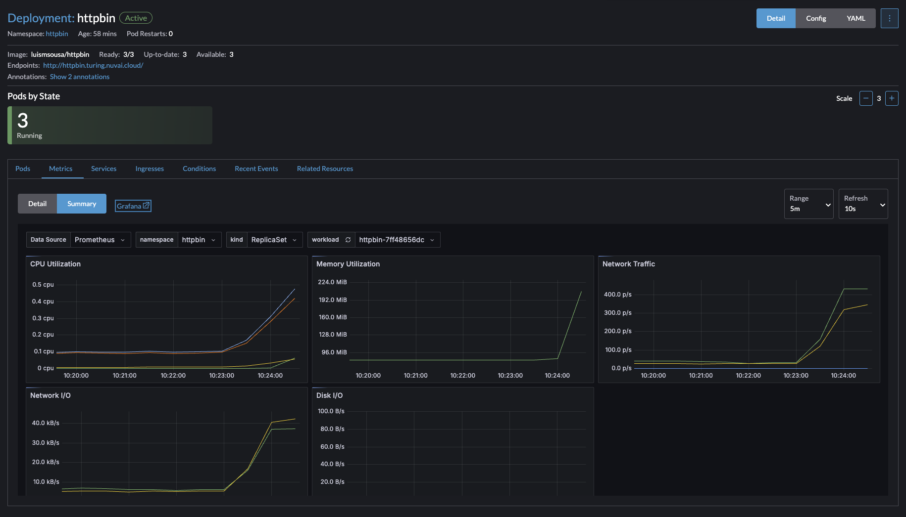
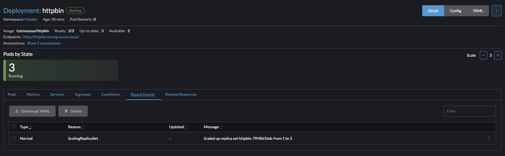
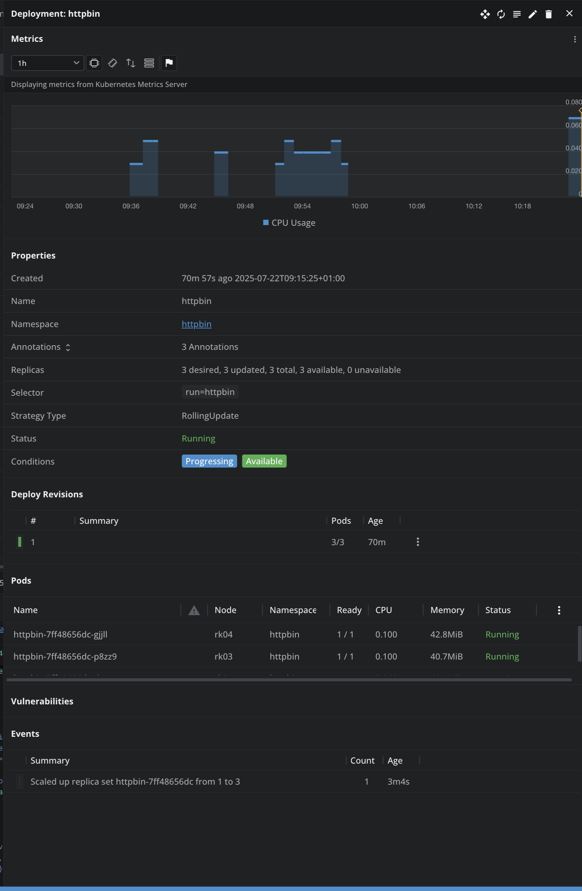
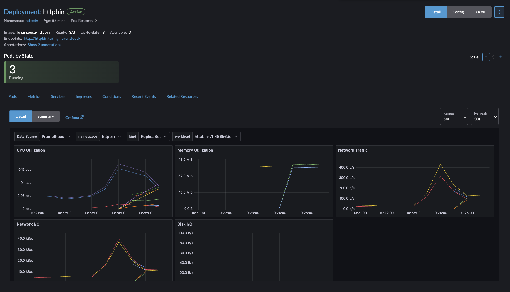

# k8s-test

## Provisioning the Cluster

In this particular example, I'm going to run this in my home cluster (set up using rancher and k3s) but the "Live" environment would likely be run in a PAAS like AWS EKS.

### Cluster Security

* This cluster would be private and the control API would only be accessible with a tool like tailscale or wireguard VPN.
* The authentication to the cluster would be based on IAM users and roles (Source: <https://docs.aws.amazon.com/eks/latest/userguide/cluster-auth.html>)
* I'm setting up a traefik instance in front of the service to take care of the TLS termination. In this particular case it's using LetsEncrypt certificates using a DNS challenge and picking up the annotations of the ingress object.
  * In a production environment, there would be a load balancer controller provisioned ALB that would handle this requirement.
  * If there's an additional requirement for end to end encryption then we'd be looking at provisioning some sort of service mesh like istio or api gateway like ambassador.

## Provisioning the workload

Because the provided image <https://hub.docker.com/r/kennethreitz/httpbin> does not have an arm64 build, so rather than building a new cluster, I've forked <https://github.com/luismsousa/httpbin> the underlying repo, set up a github actions pipeline to do a multi-arch build of the image and upload it to dockerHub <https://hub.docker.com/r/luismsousa/httpbin>.
In forking the repo, I had to update the dockerfile so that the additional packages required for the arm build to succeed.
Using the built-in Metrics server, we'll be setting up a horizontal pod autoscaller to monitor the `cpu` and `memory` metrics but we could also set up a custom metric from our ingress to track the number of request per second and scale on demand.

To deploy this example, all that's needed is to run:

```bash
kubectl apply -f deployment
kubectl run -i --tty load-generator -n httpbin --rm --image=busybox:1.28 --restart=Never -- /bin/sh -c "while sleep 0.01; do wget -q -O- http://httpbin/uuid; done"
```

Monitor the deployment and you'll see the HPA provisioning new instances.

## Assumptions & Caveats

* Traefik is the ingress controller and cert-manager is provisioning letsencrypt certificates
* My cluster is relatively small, so I've limited the max pods to 4 but it proves the point that we can reach that number.
* If we were to use the ingress metrics, then we'd need to change the load generator target url to the ingress endpoint. This example assumes that the load generator is calling the httpbin service directly.

## Graphs

Below are some example screenshots from the `screengrabs` folder showing the deployment, HPA scaling, and monitoring dashboards:

### 1. Pre-Ramp up graph



### 2. HPA Scaling




### 3. Grafana Dashboard


